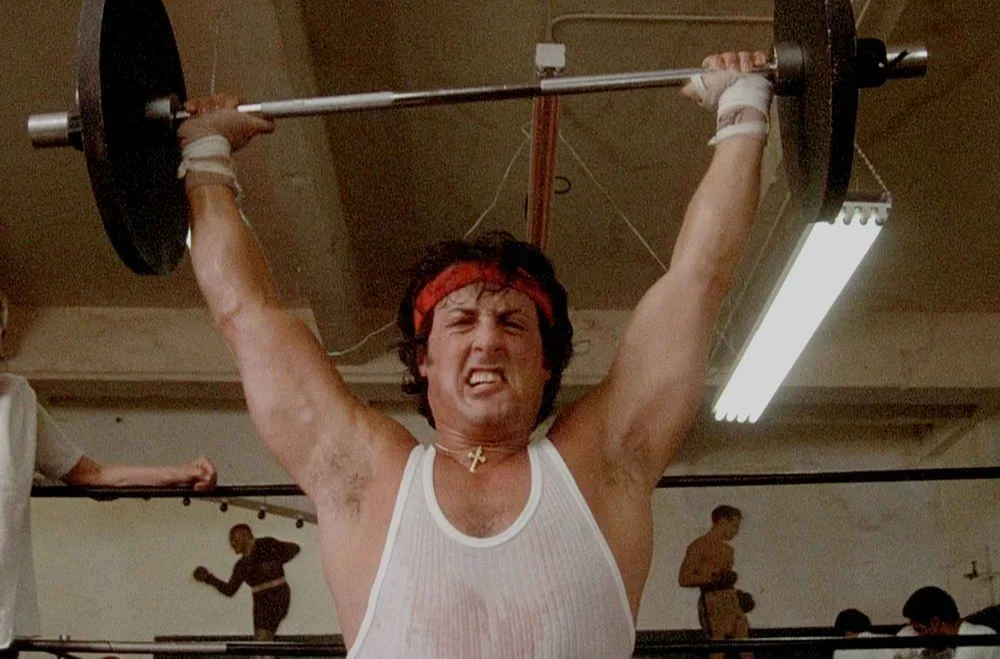
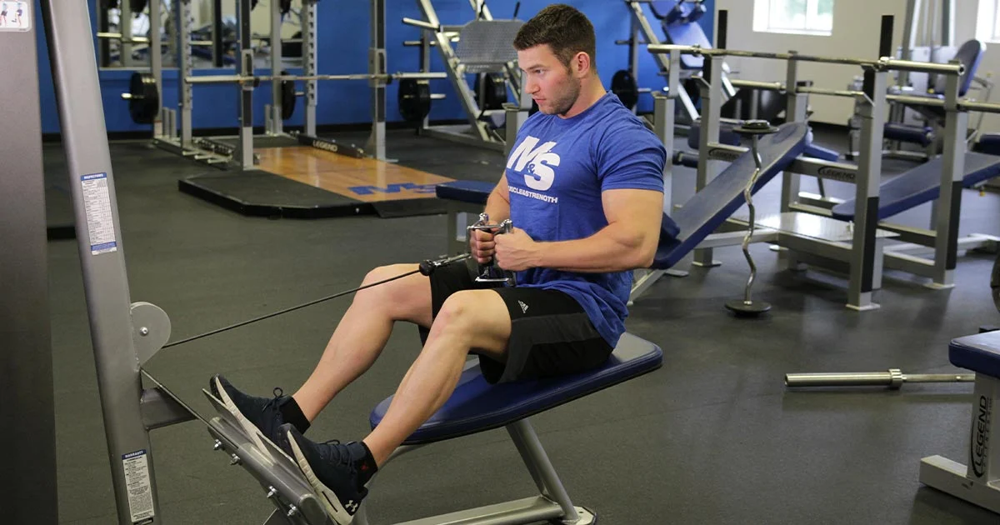
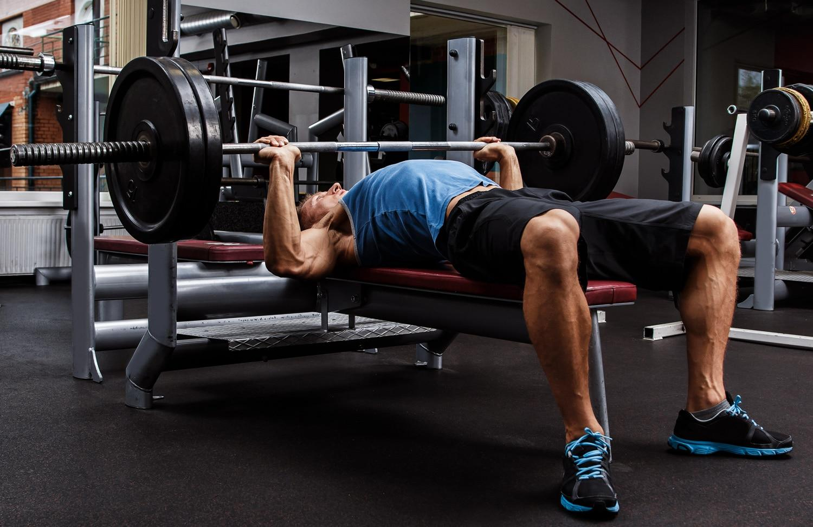
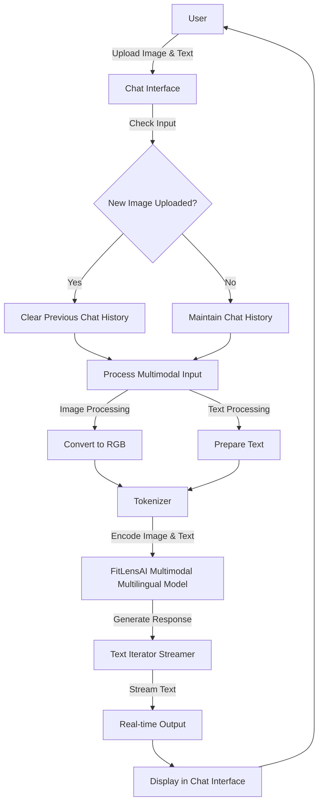

# 🏋️‍♂️ FitLensAI - Snap, Ask, Understand Your Exercise

FitLensAI is a multimodal large language model with multilingual (English and বাংলা) and multi-turn conversational capabilities, that helps you understand fitness workouts from images.

## Examples

| Input Image                  | Input Question and Output Answer                                                                                                                                                                                                                                                                                                                                                                                                                                                                                                                                                               |
| ---------------------- | --------------------------------------------------------------------------------------------------------------------------------------------------------------------------------------------------------------------------------------------------------------------------------------------------------------------------------------------------------------------------------------------------------------------------------------------------------------------------------------------------------------------------------------------------------------------- |
|  | **Can you recognize this workout from the image?** Plank  **From this image, which muscle is activated the most effectively by this exercise?** Rectus abdominis, transverse abdominis, obliques  **Based on the image, how should I move through each part of this workout?** Lie face down on the ground. Place forearms on the ground next to your chest. Extend arms until palms are pressed to the ground. Engage core by drawing belly button towards spine. Lower torso until forearms, elbows, and chest touch the ground. In this position, resist the temptation to drop hips or head. Focus on keeping hips, shoulders, and head aligned. Hold for 20-60 seconds.                            |
|  | **ছবিতে, ব্যায়াম কি?** ওভারহেড প্রেস  **এই ওয়ার্কআউট টার্গেট কোন পেশী?** উপরের ডেলটোইড, উপরের ট্রিক্সপস, ওভারহেড প্লেট  **এই ব্যায়াম করার পদক্ষেপ কি কি?** পায়ের মত দাঁড়িয়ে, হাত উঁচু ওজনবিধ্বনের সঙ্গে শীর্ষটি ছোড়ে দাঁড়ান। প্রতিটি লংগস্ট্রাপের আলাদা হাতের                                                                                                                                                                                                                                                                                                                |

## About

If you've been at the local gym, you know there are countless number of exercises, both cardio and weight training, that focus on different parts of the body. What if you wanted to know about a specific workout, like the name, which muscles are targeted and how to correctly do it?

I developed Fitness-VQA, a multimodal multilingual (English and বাংলা) dataset that enables seamless multi-turn conversations for visual question answering about fitness workouts.

FitLensAI is a Llama 3.2 Vision 11B vision-language model (VLM) trained using low-rank adaptation (LoRA) for parameter-efficient fine-tuning on Fitness-VQA. FitLensAI generates tailored responses to questions about fitness workout images in English and বাংলা, and enables dynamic multi-turn conversations.

The methodology and technical details of its creation will be added later.

## Features

### FitLensAI can generate specialized responses for fitness workouts

| Question | Llama 3.2 Vision Reponse | FitLensAI Response |
|----------|------------------|--------------|
| What is the name of the workout? | The seated row is a compound exercise that targets the latissimus dorsi, trapezius, rhomboids, and biceps muscles. It is an effective exercise for building strength and size in the back, and can be performed with or without a barbell. | Seated Cable Row |
| Which body part is the focus of the workout? | The seated row is a compound exercise that targets the latissimus dorsi, trapezius, rhomboids, and biceps muscles. It is an effective exercise for building strength and size in the back, and can be performed with or without a barbell. | Latissimus Dorsi, Rear Deltoids, Rhomboids, Biceps |
| How do I do this exercise step by step from the image? | Here are the steps to do a seated row exercise: 1)Sit on the rowing machine with your feet flat on the floor or on the footrests, depending on the machine. 2) Grasp the bar with an overhand grip, with your hands slightly wider than shoulder-width apart. 3) Lean back slightly and keep your back straight, engaging your core muscles to maintain good posture. 4) Pull the bar towards your chest, keeping your elbows close to your body and your biceps engaged. 5) Squeeze your shoulder blades together and pull the bar towards your chest, then slowly return to the starting position. 6) Repeat for the desired number of repetitions. Remember to focus on proper form and technique to get the most out of the exercise and avoid injury. | Sit on seated cable row machine with legs extended. Grip attachment with hands slightly wider than shoulders. Pull attachment to lower chest, focusing on pulling movement with upper back and lats. Avoid using momentum and swinging. Touch chest lightly with attachment, then push body forward slightly to return attachment to starting position. Maintain upright posture throughout movement. |

Existing MLLMs like Llama 3.2 are not capable of generating specialized responses. This is because MLLMs are generalist models that can perform wide range of tasks, think jack of all trades. The example above shows that while Llama 3.2 is able to understand the question, the output is not precise and quite often irrelevant, leading to information overload! In contrast, FitLensAI gives precise, concise and context-appropriate answers.

### FitLensAI is designed for multilingual conversations

| Question | Llama 3.2 Vision Reponse | FitLensAI Response |
|----------|------------------|--------------|
| ছবিতে, ব্যায়াম কি? | ব্যাঙ্গ একটি বিশেষ ধরনের বারবেল্ট ব্যাগ যা একটি প্লেট দিয়ে ঘন্টার চেয়ে বেশি ওজন বহন করে দুই হাতে ধরে উঠে উঠানোর জন্য ব্যবহৃত হয়। এটি ব্যায়ামের একটি ক্লাসিক কৌশল যা পেশী শক্তি বৃদ্ধির জন্য ব্যবহৃত হয়। | বেন্চ প্রেস |
| এই ওয়ার্কআউট টার্গেট কোন পেশী? | ব্যাঙ্গের ওয়ার্কআউট মূলত পেশীগুলির গ্রুপের একটি অংশের উপর ফোকাস করে, যা সামনের পায়ের পেশী সহ মোটামুটি সামনের দিকের পেশীগুলিকে অধিগত করে। এই পেশীগুলির মধ্যে রয়েছে: ট্রায়াসেপস সার্ভিস: এই পেশ | পেকস, ডেলটোইডস, ট্রিক্সপস, প্লেক |
| এই ব্যায়াম করার পদক্ষেপ কি কি? | ব্যাঙ্গ ব্যাগ করার জন্য নিম্নলিখিত পদক্ষেপগুলি অনুসরণ করুন: অবস্থান নির্বাচন করুন: একটি ব্যাঙ্গ ব্যাগ ব্যাগ করার জন্য, আপনাকে একটি বেন্চ বা একটি ব্যাঙ্গ স্ট্যান্ডে চেয়ার বা একটি ব্যাঙ্গ ব্যাগ ব্যাগ করার জন্য সম্পূর্ণ প | বিসেপ বার জড়িয়ে ব্রেস্টের উপর দাঁড়িয়ে, নমনীয়ভাবে হাতগুলিতে বারটি ধাক্কা দিয়ে, হাতগুলির গুঠন বে |

Current MLLMs primarily focus on English and few other major languages, limiting practical applications in multilingual settings. Some examples include VLMs like Pixtral, Qwen-VL and more recently Llama 3.2 Vision. In the example, Llama 3.2 generates incorrect sentences and keywords that are entirely out of context. FitLensAI performs somewhat better, as it produces responses that are more relevant. While it fails to generate accurate long sequences in detail, the words are related to fitness workouts.

### Limitations

The model fails when tasked with describing workouts in বাংলা, especially when required to generate long and coherent sequences of text. While Fitness-VQA includes question-answer pairs in বাংলা, the dataset is insufficient for the model to learn and generate accurate, context-appropriate and detailed responses in the language. It struggles to understand and capture the nuances of বাংলা, resulting in incomplete or irrelevant outputs. Future work will aim at incorporating diverse and extensive multilingual training data to enhance the model's ability to handle such tasks effectively and expand its applicability real-world multilingual scenarios.

### System Architecture

### Takeaways

This project demonstrates that we can carefully design datasets such that a single model can have multimodal, multilingual and multi-turn conversational capabilities. All this, without relying on other models, for example machine translation models to translate from one language to another.

### Todos

* More data to make it work for long sequences in বাংলা
* Train Pixtral 12B

## Acknowledgements

This system was built on top of [Llama 3.2 Vision 11B](https://ai.meta.com/blog/llama-3-2-connect-2024-vision-edge-mobile-devices/).
